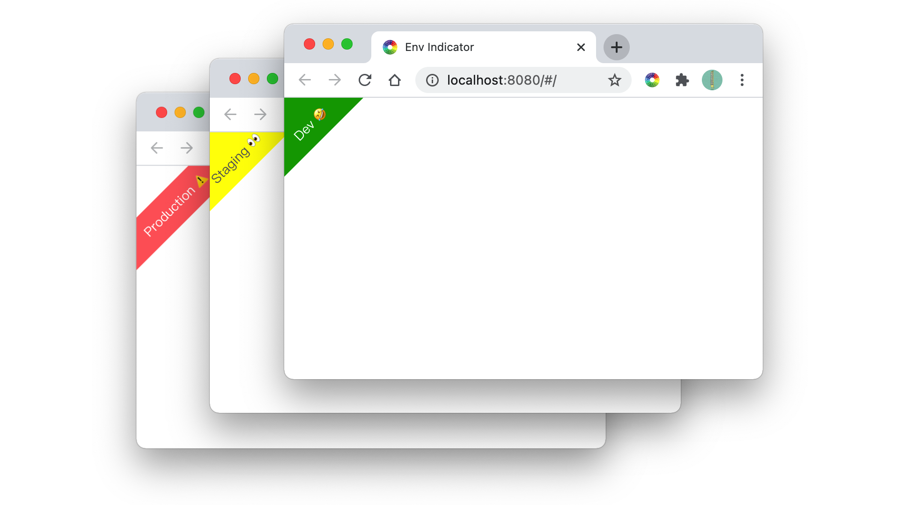
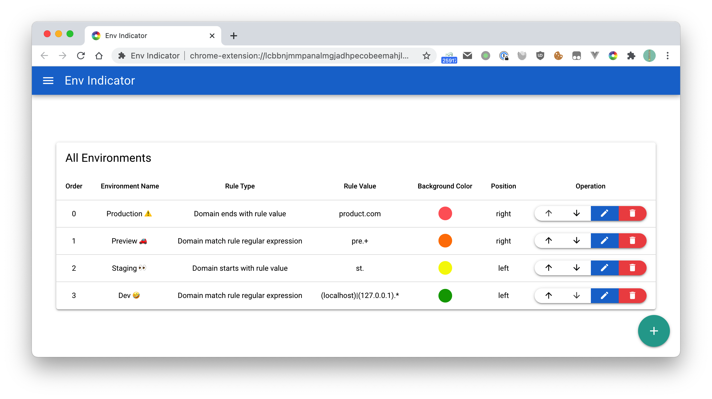

# Environment Indicator Browser Extension


<p align="center">
    
</p>

<p align="center">
  <a href="https://travis-ci.com/gaoliang/env-indicator"></a>
  <a href="https://chrome.google.com/webstore/detail/env-indicator/kgdbcpllbbnimjgoiomfdebldcofmlbl"></a>
  <a href="https://chrome.google.com/webstore/detail/env-indicator/kgdbcpllbbnimjgoiomfdebldcofmlbl"></a>
  <a href="https://chrome.google.com/webstore/detail/env-indicator/kgdbcpllbbnimjgoiomfdebldcofmlbl"></a>
  <a href="https://addons.mozilla.org/zh-CN/firefox/addon/env-indicator"></a>
  <a href="https://microsoftedge.microsoft.com/addons/detail/nlgegepgfcagnbjdnjbaoiiooklkhlcj"></a>

</p>

Add an environment marker to differentiate QA environments from production. In addition, you can create your own indicator rules

### Screenshots



### Features
🌟 1. Support setting the marker as a triangle ◤ or ribbon. 🎗

🌟 2. Support setting the background color and text color of the marker. 🎨

🌟 3. Support to configure the marker to the upper left or upper right corner of the page.

🌟 4. Support regular expression matching, prefix matching, suffix matching and inclusion matching for host to differentiate different environments.


### Special Thanks
[](https://jb.gg/OpenSource)


## Develop Guide

### Install the quasar-cli and dependencies
```bash
yarn global add @quasar/cli
yarn
```

### Start the app in development mode (hot-code reloading, error reporting, etc.)
```bash
quasar dev -m bex -T chrome
```

### Lint the files
```bash
yarn run lint
```

### Build the app for production
```bash
 quasar build -m bex -T chrome
 ```

### Customize the configuration
See [Configuring quasar.conf.js](https://quasar.dev/quasar-cli/quasar-conf-js).
